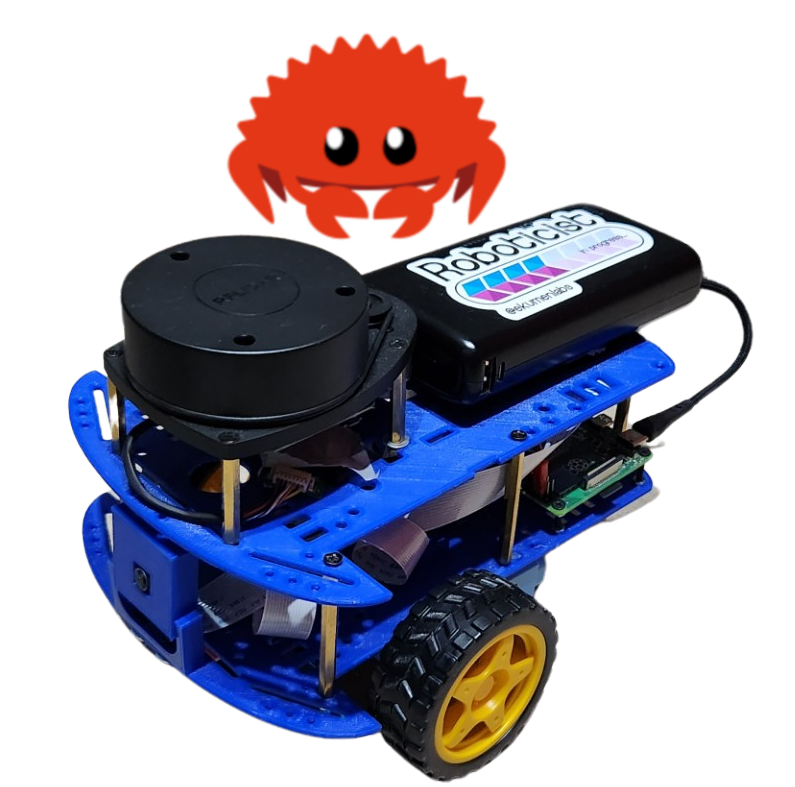
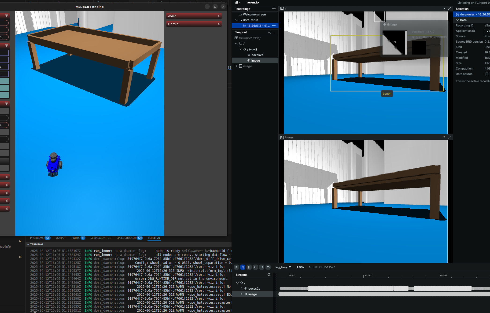

<div align="center">

  

</div>

<div align="center">

  

</div>

# andino-rs

Oxidizing the [andino](https://github.com/Ekumen-OS/andino) robot.

<p align="center">
  
</p>

## :globe_with_meridians: Description

This project provides a rustacean version of the [andino](https://github.com/Ekumen-OS/andino) robot.

> [!TIP]
> *andino* is a fully open-source diff drive robot designed for educational purposes and low-cost applications. Its ecosystem comprehends several integrations with many frameworks and simulations. Refer to official website: https://github.com/Ekumen-OS/andino
to know more about *andino* and its ecosystem.

## Prerequisites

For the real robot, refer to official instructions on [building an andino](https://github.com/Ekumen-OS/andino/tree/humble/andino_hardware).

For simulation, refer to [workspace setup](#workspace-setup) instructions.

## Platforms

 - OS:
   - Ubuntu 22.04 Jammy Jellyfish
   - Ubuntu Mate 22.04 (On real robot (e.g: Raspberry Pi 4B))

## :package: Project structure

 - [`andino`](/andino/): Core library for andino robot. It provides a hardware abstraction layer (HAL) to communciate with the andino robot.
 - [`andino_dora`](/andino_dora/): It provides dora dataflows to run andino-integration.
 - [`andino_dora_sim`](/andino_dora/): It provides dora dataflows to run andino simulation.
 - [`dora_node_hub`](/dora_node_hub/): Dora nodes.
   -  [`dora_andino_hal`](dora_node_hub/dora_andino_hal): Integration of the andino hal with Dora.
   -  [`dora_andino_mujoco_sim`](dora_node_hub/dora_andino_mujoco_sim): Integration of the andino mujoco simulation with Dora.
   -  [`dora_diff_drive_controller`](dora_node_hub/dora_diff_drive_controller): Differential drive controller to be used in Dora frameworks.
   -  [`dora_teleop_keyboard`](dora_node_hub/dora_teleop_keyboard): Dora node for teleoperating mobile robots using the keyboard.


## :pick: Workspace setup

Refer to [.devcontainer/README.md](.devcontainer/README.md)

## :gear: Build

### Build systems

This repository combines both `rust` and `python` packages. `cargo` and `uv` are the tools of choice.

 - Building `rust` packages:
    ```
    cargo build
    ```
 - Building `python` packages:
    ```
    uv build --all-packages
    ```

## *`dora`* Integration

What is dora? See https://dora-rs.ai/

### `andino_dora` package

<a href="https://youtu.be/USMwRiCDfIU" target="_blank">
 
</a>

[`andino_dora`](andino_dora) package provides serveral dora dataflows to use with the *andino* robot.

Check [`andino_dora`'s README](andino_dora) for more information on how to run it.

### `andino_dora_sim` package

<p align="center">
  
</p>

[`andino_dora_sim`](andino_dora_sim) package provides serveral dora dataflows for using simulations instead of the real robot to speed up development or if you don't have an *andino* built yet.

Check [`andino_dora_sim`'s README](andino_dora_sim) for more information on how to run it.

### `dora_node_hub` folder

Dora nodes created to support the dora integration. These nodes are used in many of the dataflows created at `andino_dora` and `andino_dora_sim` packages.
See [dora_node_hub](./dora_node_hub) folder.

### Appendix

#### On Running the Dora dataflows

`dora run <path_to_dataflow>` runs the dataflow locally. Alternatively, you can run first the coordinator and daemon with `dora up` and then `dora start <path_to_dataflow>` to start the dataflow.
By default the coordinator is run at localhost and daemon pointing there. You can use a different setup. Follow the options from the `dora --help` CLI.

## :raised_hands: Contributing

Issues or PRs are always welcome! Please refer to [CONTRIBUTING](CONTRIBUTING.md) doc.

## Code development

 - Workspace setup: Refer to [.devcontainer/README.md](.devcontainer/README.md)
 - This repository uses `pre-commit`.
    - To add it to git's hook, use:
     ```
     pip install pre-commit
     pre-commit install
     ```
    - Every time a commit is attempted, pre-commit will run. The checks can be by-passed by adding `--no-verify` to *git commit*, but take into account pre-commit also runs as a required Github Actions check, so you will need it to pass.
