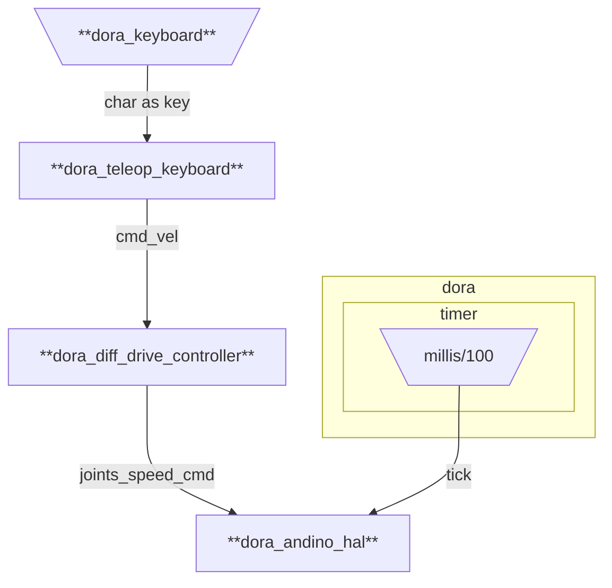

# andino-rs

Oxidizing [andino](https://github.com/Ekumen-OS/andino) robot.

## Description

This project provides a rustacean version on top of an [andino](https://github.com/Ekumen-OS/andino) robot.

## Prerequisites

Refer to official instructions for [building an andino](https://github.com/Ekumen-OS/andino/tree/humble/andino_hardware).

## Platforms

 - OS:
   - Ubuntu 22.04 Jammy Jellyfish
   - Ubuntu Mate 22.04 (On real robot (e.g: Raspberry Pi 4B))

### Project structure

 - [`andino`](/andino/): Core library for andino robot. It provides a HAL abstraction to communciate with andino robot.
 - [`andino_dora`](/andino_dora/): It provides dora dataflows to run andino-integration.
 - [`dora_node_hub`](/dora_node_hub/): Dora nodes.
   -  [`dora_andino_hal`](dora_node_hub/dora_andino_hal): Integration of the andino hal with Dora.
   -  [`dora_diff_drive_controller`](dora_node_hub/dora_diff_drive_controller): Differential drive controller to be used in Dora frameworks.
   -  [`dora_teleop_keyboard`](dora_node_hub/dora_teleop_keyboard): Dora node for teleoperating mobile robots using the keyboard.


## Workspace setup

Refer to [.devcontainer/README.md](.devcontainer/README.md)

## Build

```
cargo build
```

## Dora Integration

What is dora? See https://dora-rs.ai/

### Teleoperating the Andino robot



Build the `andino_dora`'s dataflow
```
dora build andino_dora/graphs/dataflow.yml
```

Run the dataflow locally:
```
dora run andino_dora/graphs/dataflow.yml
```

### Appendix

#### On Running the Dora dataflows

`dora run <path_to_dataflow>` runs the dataflow locally. Alternatively, you can run first the coordinator and daemon with `dora up` and then `dora start <path_to_dataflow>` to start the dataflow.
By default the coordinator is run at localhost and daemon pointing there. You can use a different setup. Follow the options from the `dora --help` cli
