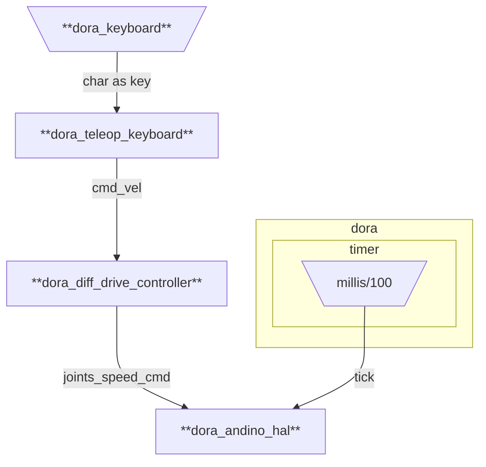

# andino_dora

Dora integration of Andino platform

## Graphs

### dataflow.yml

Teleoperate andino robot with the keyboard.



Build the `andino_dora`'s dataflow
```
dora build graphs/dataflow.yml
```

Run the dataflow locally:
```
dora run graphs/dataflow.yml
```
