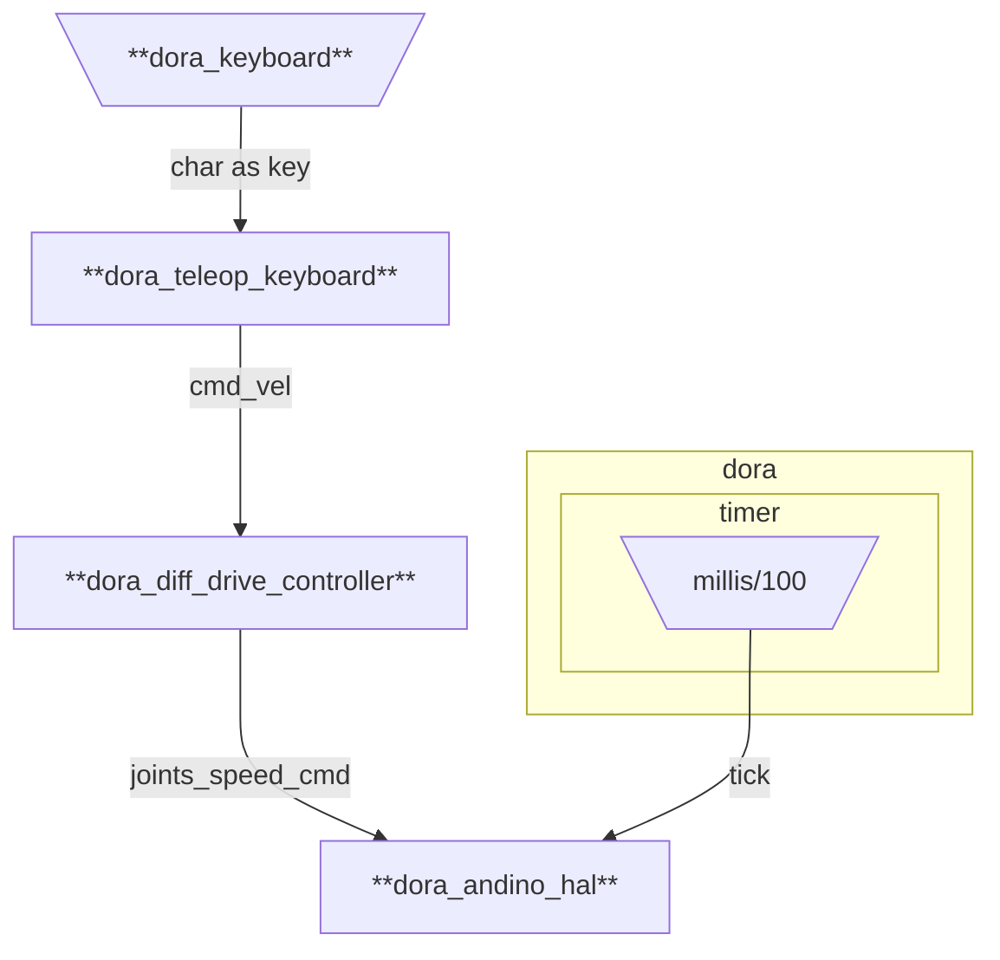
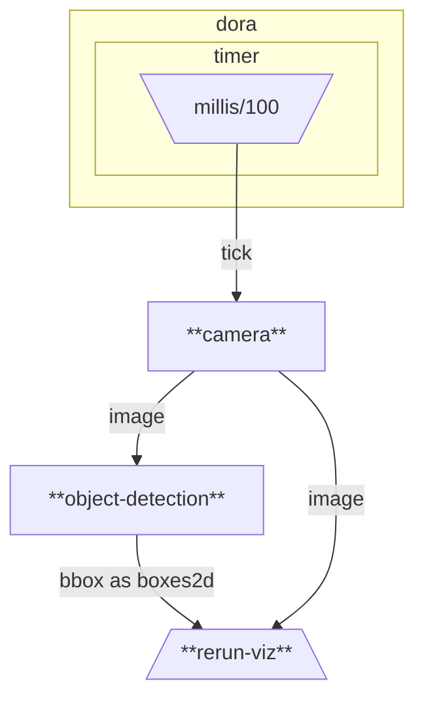
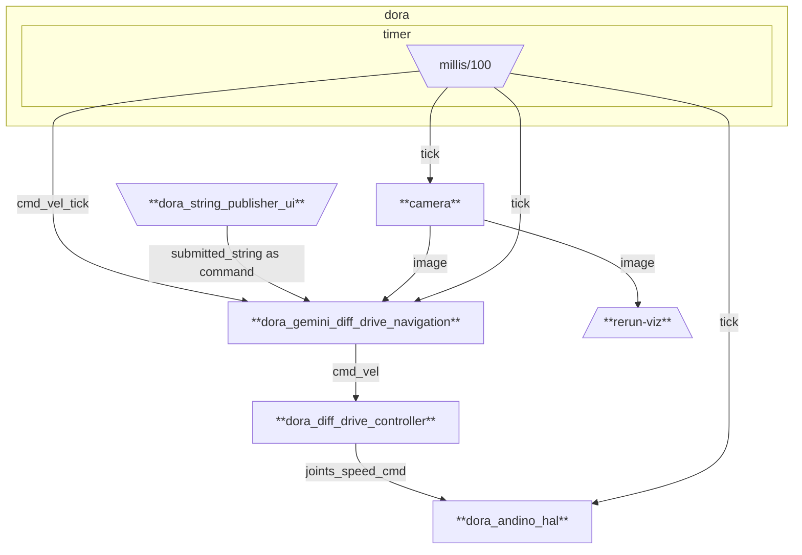

# andino_dora

Dora integration of Andino platform

## Graphs

### dataflow.yml

Teleoperate andino robot with the keyboard.



Build the `andino_dora`'s dataflow
```
dora build graphs/dataflow.yml
```

Run the dataflow locally:
```
dora run graphs/dataflow.yml
```

### object_detection.yml

Runs a dataflow to run object detection algorithm.



Build the dataflow:
```
dora build graphs/object_detection.yml
```

Run the dataflow locally:
```
dora run graphs/object_detection.yml
```

Run the Rerun server locally (not on the andino):
```
rerun --serve --web-viewer --bind <your_ip>
```

### gemini_navigation.yml



Runs a dataflow that uses [Gemini](https://gemini.google.com/app) API for navigating the Andino based on user inputs.

1. Obtain a [Gemini API Key](https://aistudio.google.com/apikey) and add it as environment variable to the correspondent node in the [gemini_navigation.yml](graphs/gemini_navigation.yml) dataflow.

2. Build the dataflow:
```
dora build graphs/gemini_navigation.yml
```

3. Run the dataflow locally:
```
dora run graphs/gemini_navigation.yml
```

4. Run the Rerun server locally (not on the *andino*):
```
rerun --serve --web-viewer --bind <your_ip>
```

5. Use the GUI to input a command to be followed by the Andino.
