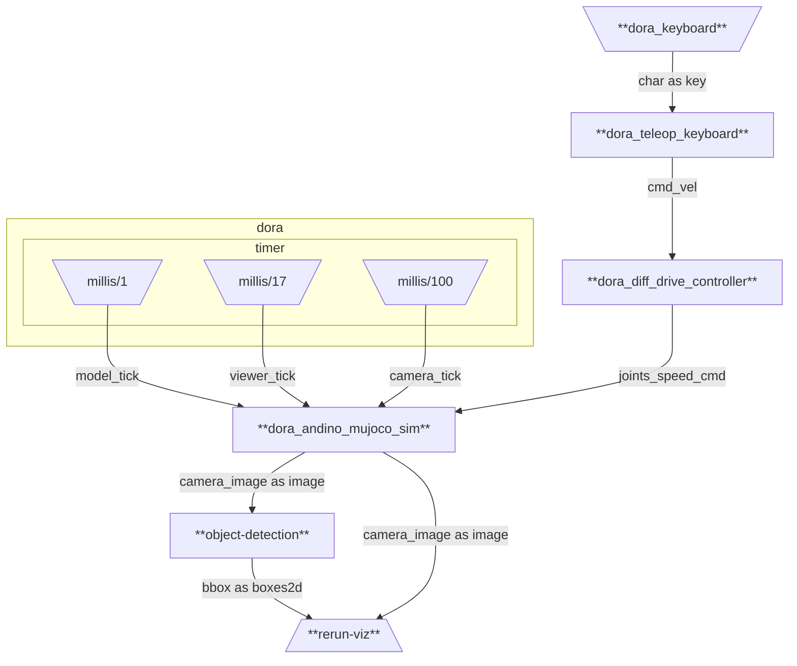

# andino_dora_sim

Dora integration of Andino Simulation

## Graphs

### mujoco_sim.yml

<p align="center">
  
</p>

Runs a dataflow for running the andino MuJoCo simulation along with:
 - keyboard teleoperation of the robot.
 - object detection using YOLOv8.
 -  `rerun` visualization.



Build the dataflow:
```
dora build graphs/mujoco_sim.yml
```

Run the dataflow locally:
```
dora run graphs/mujoco_sim.yml
```
