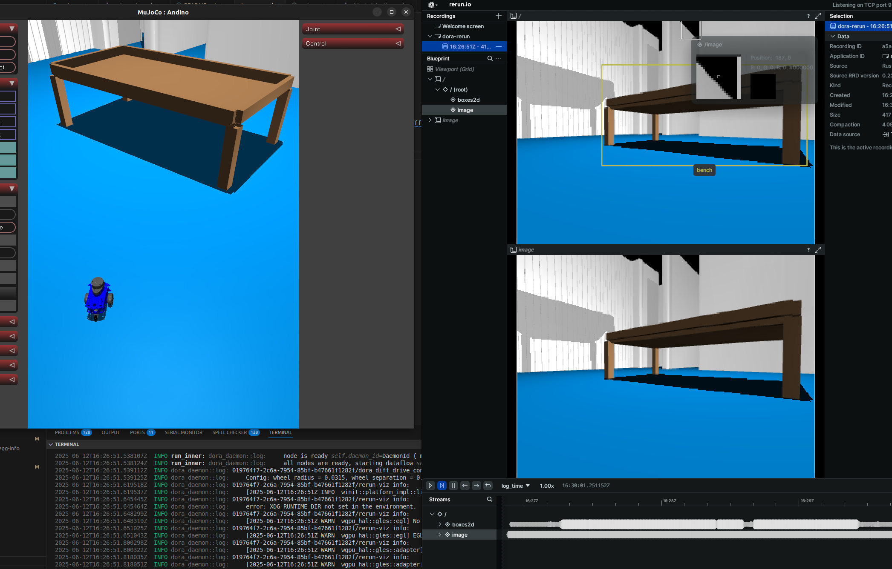
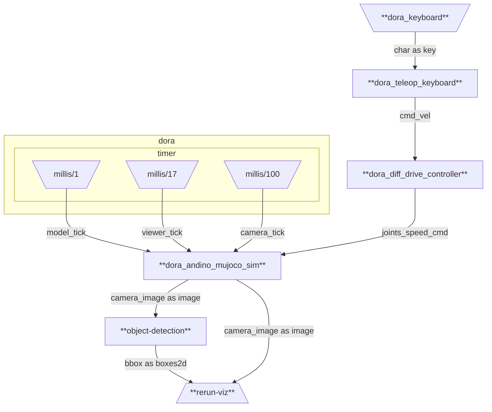
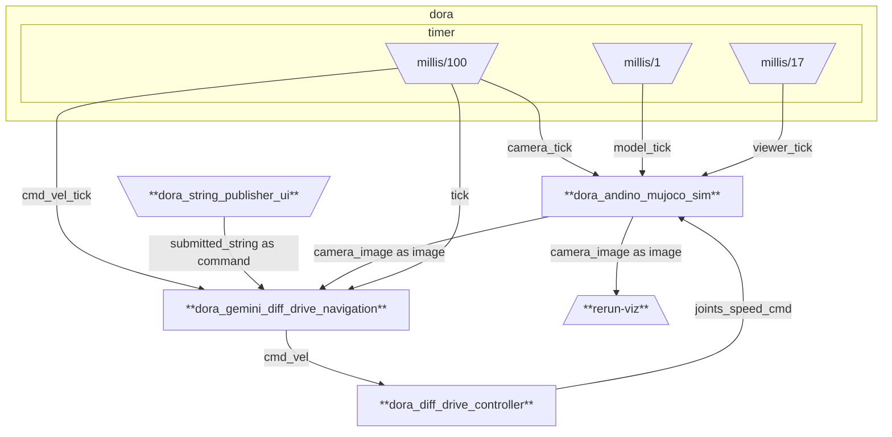

# andino_dora_sim

Dora integration of Andino Simulation

## Graphs

### mujoco_sim.yml

<p align="center">
  
</p>

Runs a dataflow for running the andino MuJoCo simulation along with:
 - keyboard teleoperation of the robot.
 - object detection using YOLOv8.
 -  `rerun` visualization.



Build the dataflow:
```
dora build graphs/mujoco_sim.yml
```

Run the dataflow locally:
```
dora run graphs/mujoco_sim.yml
```

### mujoco_sim_gemini_navigation.yml



Runs a dataflow that uses [Google's Gemini](https://gemini.google.com/app) API to provide navigation capabilities to Andino.

1. Obtain a [Gemini API Key](https://aistudio.google.com/apikey) and add it as an environment variable to the corresponding node in the [mujoco_sim_gemini_navigation.yml](graphs/mujoco_sim_gemini_navigation.yml) dataflow.

2. Build the dataflow:
```
dora build graphs/mujoco_sim_gemini_navigation.yml
```

3. Run the dataflow locally:
```
dora run graphs/mujoco_sim_gemini_navigation.yml
```

4. Use the GUI to issue a command for Andino to execute.
