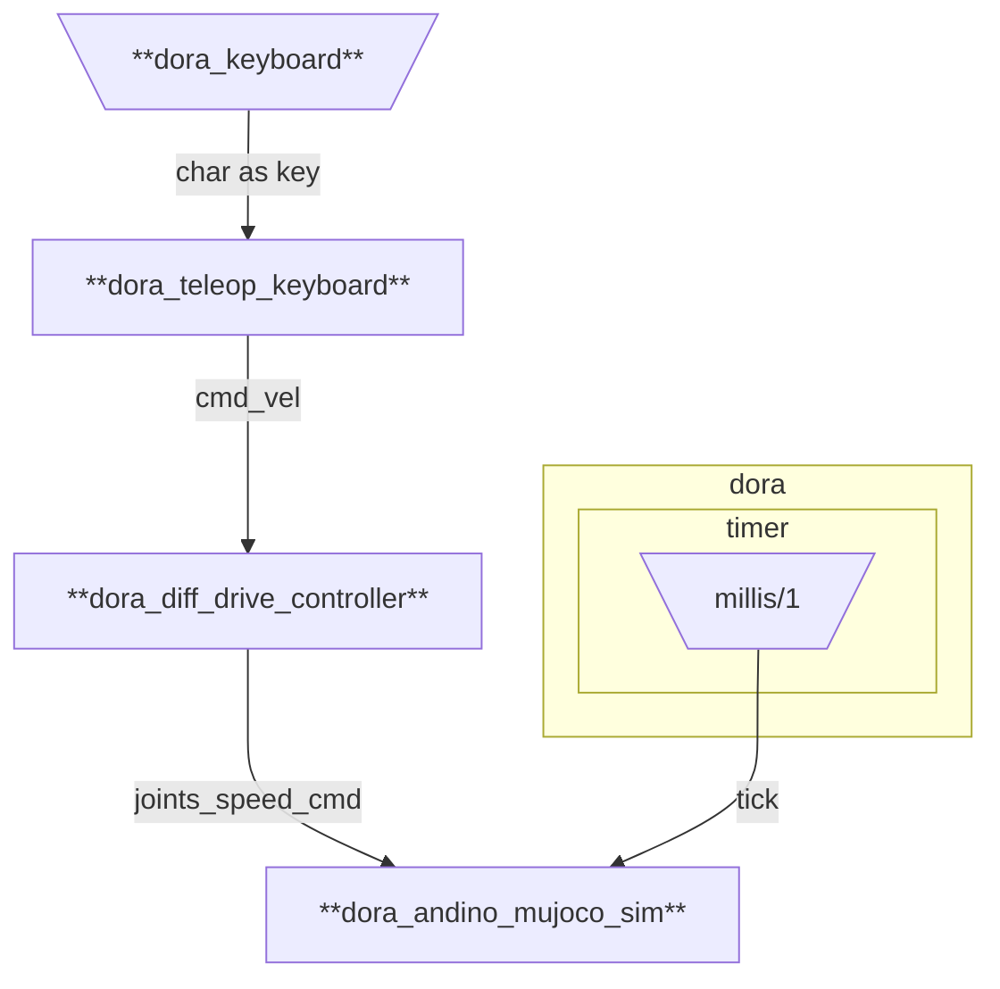

# andino_dora_sim

Dora integration of Andino Simulation

## Graphs

### mujoco_teleoperation.yml

Runs a dataflow for running the andino MuJoCo simulation and teleoperate the robot.



Build the dataflow:
```
dora build graphs/mujoco_teleoperation.yml
```

Run the dataflow locally:
```
dora run graphs/mujoco_teleoperation.yml
```
